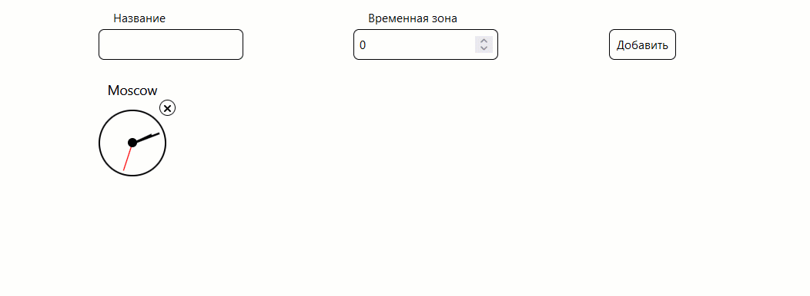

Задача на жизненные циклы компонентов
===

#### Нужно создать компонент, отрисовывающий часы. Часы должны идти, показывать время в своей временной зоне. При удалении часов должна происходить "смерть" компонента - его данные более не должны быть получены.

#### Верхняя форма добавляет новые часы.

## Решение задачи
